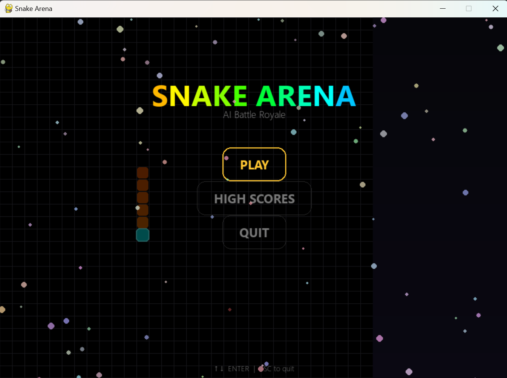
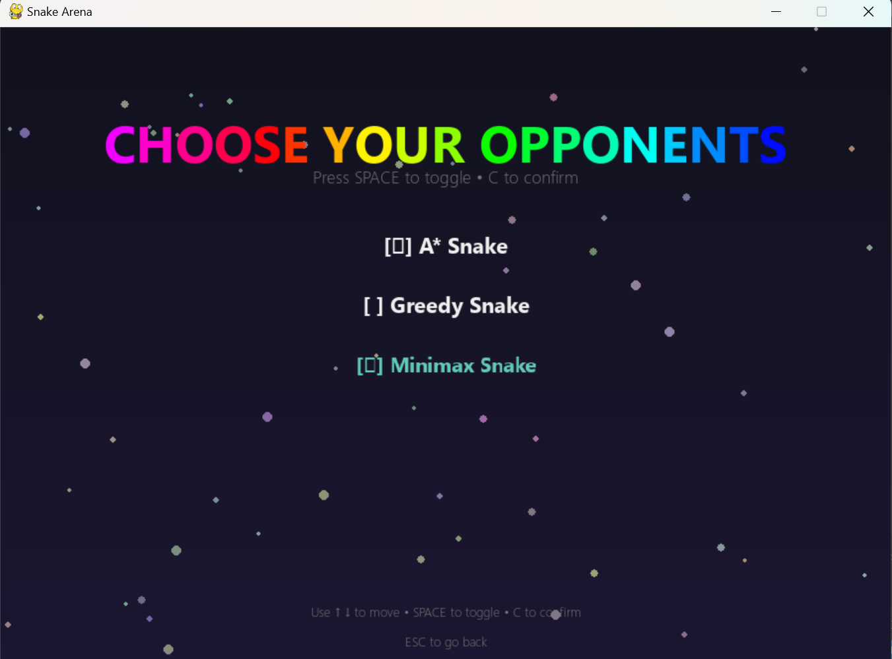
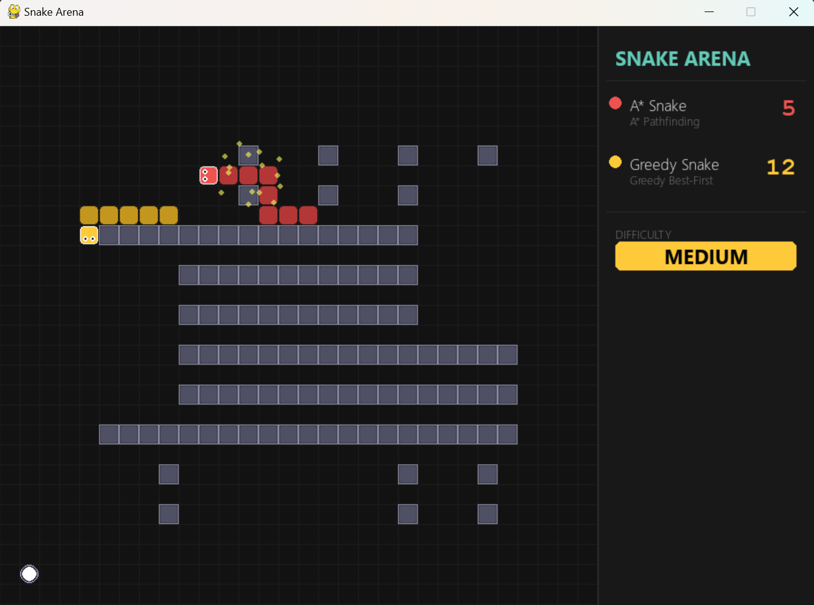

# 🐍 Snake Arena – AI-Powered Snake Game


A modern **AI-powered Snake game** built with **Python** and **Pygame** that showcases multiple Artificial Intelligence algorithms competing in real-time.

The project features both **Player vs AI** and **AI vs AI** gameplay while implementing classical AI techniques including **A\* Search**, **Greedy Best-First Search**, and **Minimax with Alpha-Beta Pruning**.

---

# 📸 Screenshots

## 🏠 Main Menu



---

## 🤖 AI Selection



---

## 🎮 Gameplay



---

## ⚔ AI Battle


---

## 🏆 High Scores


---

# ✨ Features

- 🎮 Two gameplay modes
  - Player vs AI
  - AI vs AI Battle
- 🤖 Three AI agents with different decision-making strategies
- 🧠 A\* Search pathfinding
- ⚡ Greedy Best-First Search
- ♟ Minimax with Alpha-Beta Pruning
- 🎯 Adjustable difficulty levels
- ⚙ Custom game speed
- 🗺 Multiple map layouts
- 🥇 Persistent high score system
- 🎵 Background music and sound effects
- ✨ Particle effects and animations
- 🏗 Scene-based game architecture

---

# 🧠 AI Algorithms

## ⭐ A\* Search

Uses an optimal pathfinding algorithm to reach food while minimizing travel cost.

When no valid path exists, the AI switches to a **Flood Fill survival strategy** to maximize available movement space.

---

## ⚡ Greedy Best-First Search

Chooses the move that appears closest to the food using the Manhattan heuristic.

On higher difficulties the AI becomes more aggressive by considering nearby opponents.

---

## ♟ Minimax + Alpha-Beta Pruning

Evaluates future game states before making a move.

Uses Alpha-Beta pruning to reduce unnecessary search while selecting safer and more strategic decisions.

---

# 🛠 Tech Stack

| Category                | Technologies                                               |
| ----------------------- | ---------------------------------------------------------- |
| Language                | Python                                                     |
| Game Engine             | Pygame                                                     |
| Artificial Intelligence | A\*, Greedy Best-First Search, Minimax, Alpha-Beta Pruning |
| Data Structures         | Priority Queue, Graph Search                               |
| Storage                 | JSON                                                       |
| Version Control         | Git, GitHub                                                |

---

# 📂 Project Structure

```text
snake-arena-ai/
│
├── snake_arena/
│   ├── assets/
│   ├── scenes/
│   ├── ai_astar.py
│   ├── ai_greedy.py
│   ├── ai_minimax.py
│   ├── game.py
│   ├── snake.py
│   ├── maps.py
│   ├── ui.py
│   ├── constants.py
│   ├── difficulty.py
│   ├── sound_manager.py
│   ├── main.py
│   └── high_scores.json
│
├── screenshots/
├── README.md
├── requirements.txt
├── LICENSE
└── .gitignore
```

---

# 🚀 Installation

## Clone the repository

```bash
git clone https://github.com/Akbarhussain973/snake-arena-ai.git
```

---

## Navigate into the project

```bash
cd snake-arena-ai
```

---

## Install dependencies

```bash
pip install -r requirements.txt
```

---

## Run the game

```bash
cd snake_arena
python main.py
```

---

# 🎮 Controls

| Key     | Action     |
| ------- | ---------- |
| ↑ ↓ ← → | Move Snake |
| P       | Pause      |
| ESC     | Quit       |

---

# 📚 What I Learned

Developing this project strengthened my understanding of:

- Artificial Intelligence search algorithms
- A\* Pathfinding
- Greedy Best-First Search
- Minimax with Alpha-Beta Pruning
- Flood Fill algorithms
- Game state evaluation
- Decision-making algorithms
- Object-Oriented Programming
- Scene management
- Game development using Pygame
- Debugging complex AI behavior
- Git & GitHub workflow

---

# 🔮 Future Improvements

- 🌐 Online Multiplayer
- 🤖 Reinforcement Learning Agent
- 🧠 Neural Network AI
- 📈 AI Performance Analytics
- 🎥 Replay System
- 📱 Better UI animations
- ⚙ Configurable board sizes

---

# 📄 License

This project is licensed under the **MIT License**.

---

# 👨‍💻 Author

**Akbar Hussain**

Software Engineering Student

FAST National University of Computer and Emerging Sciences (FAST-NUCES)

**GitHub**

https://github.com/Akbarhussain973

---

⭐ If you enjoyed this project, consider giving it a **Star ⭐** on GitHub.
